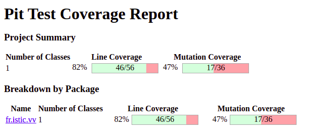

# Implementing and testing a binary heap

A [*binary heap*](https://en.wikipedia.org/wiki/Binary_heap) is a data structure that contains comparable objects and it is able to efficiently return the lowest element.
This data structure relies on a binary tree to keep the insertion and deletion operations efficient. It is the base of the [*Heapsort* algorithm](https://en.wikipedia.org/wiki/Heapsort).

Implement a `BinaryHeap` class with the following interface:

```java
class BinaryHeap<T> {

    public BinaryHeap(Comparator<T> comparator) { ... }

    public T pop() { ... }

    public T peek() { ... }

    public void push(T element) { ... }

    public int count() { ... }

}
```

A `BinaryHeap` instance is created using a `Comparator` object that represents the ordering criterion between the objects in the heap.
`pop` returns and removes the minimum object in the heap. If the heap is empty it throws a `NotSuchElementException`.
`peek` similar to `pop`, returns the minimum object but it does not remove it from the `BinaryHeap`.
`push` adds an element to the `BinaryHeap`.
`count` returns the number of elements in the `BinaryHeap`.

Design and implement a test suite for this `BinaryHeap` class.
Feel free to add any extra method you may need.

Use the following steps to design the test suite:

1. With the help of *Input Space Partitioning* design a set of initial test inputs for each method. Write below the characteristics and blocks you identified for each method. Specify which characteristics are common to more than one method.
2. Evaluate the statement coverage of the test cases designed in the previous step. If needed, add new test cases to increase the coverage. Describe below what you did in this step.
3. If you have in your code any predicate that uses more than two boolean operators check if the test cases written to far satisfy *Base Choice Coverage*. If needed add new test cases. Describe below how you evaluated the logic coverage and the new test cases you added.
4. Use PIT to evaluate the test suite you have so far. Describe below the mutation score and the live mutants. Add new test cases or refactor the existing ones to achieve a high mutation score.

Use the project in [tp3-heap](../code/tp3-heap) to complete this exercise.

## Answer

Nous avons commencé par développé les blocs qui doivent être conçu. Ensuite nous avons commencé à écrire des test :

```
class BinaryHeap<T> {

    private int heapSize;
    private T[] heap;
    private Comparator<T> comparator;

    public BinaryHeap(Comparator<T> comparator) {
        this.comparator = comparator;
    }

    public BinaryHeap(Comparator<T> comparator, T[] heap) {
        heapSize = 0;
        this.comparator = comparator;
        this.heap = heap;
    }

    public void isEmpty(){
        if (heapSize == 0) throw new NoSuchElementException("Heap is empty");
    }

    public T pop() {
        try {
            isEmpty();
            T newHeap = this.heap[0];
            delete(0);
            return newHeap;
        }catch (NoSuchElementException e){
            return (T) e;
        }
    }

    public T peek() {
        try {
            isEmpty();
            return this.heap[0];
        }catch (NoSuchElementException e){
            return (T) e;
        }
    }

    public void push(T element) {
        heap[heapSize++] = element;
        heapifyUp(heapSize - 1);
    }

    public int count() {
        return this.heap.length;
    }
}
```

Nous avons aussi ajouté de méthode tel que delete() qui supprime un élément et redescend le élément dans le heap
  
```
    public T delete(int index) {
        if (isEmpty()) throw new NoSuchElementException("BinaryHeap is empty");
        T keyItem = heap[index];
        heap[index] = heap[heapSize - 1];
        heapSize--;
        heapifyDown(index);
        return keyItem;
    }

    private void heapifyDown(int index)
    {
        int child;
        T tmp = heap[index];
        while (kthChild(index, 1) < heapSize) {
            child = minimumChild(index);
            if (comparator.compare(heap[child],tmp)==-1)
                heap[index] = heap[child];
            else
                break;
            index = child;
        }
        heap[index] = tmp;
    }
```

Nous couvrons la majoutiré des lignes de code de la classe BinaryHeap 46/56. le reste des lignes c'est les initialisations des champs.
Cependant nous couvrons seulement 47% des mutations.

Ci-dessous une capture d'ecran.

