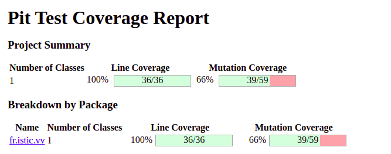

# Test the Date class

Implement a class `Date` with the interface shown below:

```java
class Date implements Comparable<Date> {

    public Date(int day, int month, int year) { ... }

    public static boolean isValidDate(int day, int month, int year) { ... }

    public static boolean isLeapYear(int year) { ... }

    public Date nextDate() { ... }

    public Date previousDate { ... }

    public int compareTo(Date other) { ... }

}
```

The constructor throws an exception if the three given integers do not form a valid date.

`isValidDate` returns `true` if the three integers form a valid year, otherwise `false`.

`isLeapYear` says if the given integer is a leap year.

`nextDate` returns a new `Date` instance representing the date of the following day.

`previousDate` returns a new `Date` instance representing the date of the previous day.

`compareTo` follows the `Comparable` convention:

* `date.compareTo(other)` returns a positive integer if `date` is posterior to `other`
* `date.compareTo(other)` returns a negative integer if `date` is anterior to `other`
* `date.compareTo(other)` returns `0` if `date` and `other` represent the same date.
* the method throws a `NullPointerException` if `other` is `null` 

Design and implement a test suite for this `Date` class.
You may use the test cases discussed in classes as a starting point. 
Also, feel free to add any extra method you may need to the `Date` class.


Use the following steps to design the test suite:

1. With the help of *Input Space Partitioning* design a set of initial test inputs for each method. Write below the characteristics and blocks you identified for each method. Specify which characteristics are common to more than one method.
2. Evaluate the statement coverage of the test cases designed in the previous step. If needed, add new test cases to increase the coverage. Describe below what you did in this step.
3. If you have in your code any predicate that uses more than two boolean operators check if the test cases written to far satisfy *Base Choice Coverage*. If needed add new test cases. Describe below how you evaluated the logic coverage and the new test cases you added.
4. Use PIT to evaluate the test suite you have so far. Describe below the mutation score and the live mutants. Add new test cases or refactor the existing ones to achieve a high mutation score.

Use the project in [tp3-date](../code/tp3-date) to complete this exercise.

## Answer

Pour le set de tests initial nous avons :

Deux test pour la validation de isValidateDate(int day, int month, int year) :
    - un test avec un bonne date (20, 10, 2022)
    - un test avec un date incorrect (35, 10, 2022)

On ne test pas la création de Date car le constructeur appelle isValidateDate dedans. 

Pour isLeapYear(): on vérifie que l'on retourne vrai si la date est une année bisextille 

Pour nextDate() : On vérifie que l'on augmente d'un jour, si c'est le dernier jour du mois, on change de mois et on met le jour à 01, et si on est le dernier jour de l'année on augmente l'année de 1 et on met le mois et le jour à 01

Pour previousDate() : On fait l'inverse que pour nextDate()

On utilise compareTo() pour comparer deux dates (utilisez dans les tests de nextDate et previousDate)

Avec la commande : mvn test-compile org.pitest:pitest-maven:mutationCoverage

Nous avons un score de couverture des lignes de 100% et un score de mutation de 66%.


